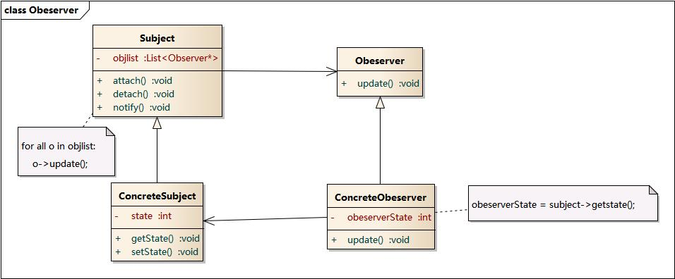

## 观察者模式

观察者模式是一种行为设计模式，定义对象间的一种一对多依赖关系，使得每当一个对象状态发生改变时，其相关依赖对象皆得到通知并被自动更新。观察者模式又叫做发布-订阅（Publish/Subscribe）模式、模型-视图（Model/View）模式、源-监听器（Source/Listener）模式或从属者（Dependents）模式。

### 模式结构

- Subject: 目标
- ConcreteSubject: 具体目标
- Observer: 观察者
- ConcreteObserver: 具体观察者

### 时序图

### 适用性

- 一个抽象模型有两个方面，其中一个方面依赖于另一个方面。将这些方面封装在独立的对象中使它们可以各自独立地改变和复用。
- 一个对象的改变将导致其他一个或多个对象也发生改变，而不知道具体有多少对象将发生改变，可以降低对象之间的耦合度。
- 一个对象必须通知其他对象，而并不知道这些对象是谁。
- 需要在系统中创建一个触发链，A对象的行为将影响B对象，B对象的行为将影响C对象……，可以使用观察者模式创建一种链式触发机制。

### 优缺点

优点:

- [x]  开闭原则。 你无需修改发布者代码就能引入新的订阅者类 （如果是发布者接口则可轻松引入发布者类）。
- [x]  你可以在运行时建立对象之间的联系。

缺点:

- [ ]  订阅者的通知顺序是随机的。

### 实现方式

1. 仔细检查你的业务逻辑， 试着将其拆分为两个部分： 独立于其他代码的核心功能将作为发布者； 其他代码则将转化为一组订阅类。
2. 声明订阅者接口。 该接口至少应声明一个update方法。
3. 声明发布者接口并定义一些接口来在列表中添加和删除订阅对象。记住发布者必须仅通过订阅者接口与它们进行交互。
4. 确定存放实际订阅列表的位置并实现订阅方法。
5. 创建具体发布者类。 每次发布者发生了重要事件时都必须通知所有的订阅者。
6. 在具体订阅者类中实现通知更新的方法。 绝大部分订阅者需要一些与事件相关的上下文数据。 这些数据可作为通知方法的参数来传递。 但还有另一种选择。 订阅者接收到通知后直接从通知中获取所有数据。 在这种情况下，
   发布者必须通过更新方法将自身传递出去。
7. 客户端必须生成所需的全部订阅者， 并在相应的发布者处完成注册工作。

### 例子

[代码](../../main/java/behavioral/observer)
   
   
