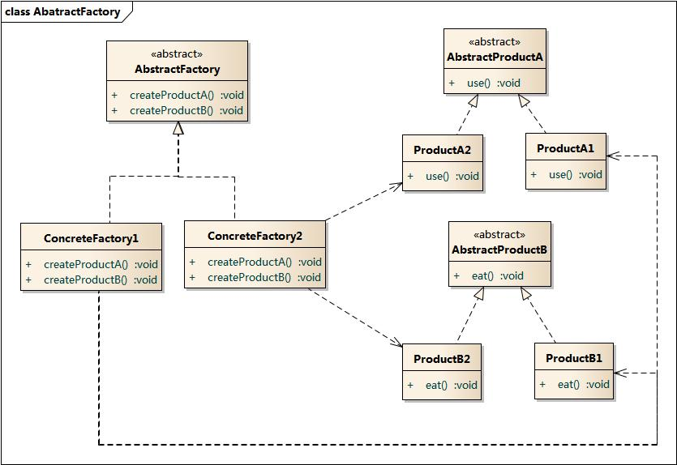

## 抽象工厂模式

在工厂方法模式中具体工厂负责生产具体的产品，每一个具体工厂对应一种具体产品，工厂方法也具有唯一性，一般情况下，一个具体工厂中只有一个工厂方法或者一组重载的工厂方法。但是有时候我们需要一个工厂可以提供多个产品对象，而不是单一的产品对象。

为了更清晰地理解工厂方法模式，需要先引入两个概念：

- **产品等级结构** ：产品等级结构即产品的继承结构，如一个抽象类是电视机，其子类有海尔电视机、海信电视机、TCL电视机，则抽象电视机与具体品牌的电视机之间构成了一个产品等级结构，抽象电视机是父类，而具体品牌的电视机是其子类。
- **产品族** ：在抽象工厂模式中，产品族是指由同一个工厂生产的，位于不同产品等级结构中的一组产品，如海尔电器工厂生产的海尔电视机、海尔电冰箱，海尔电视机位于电视机产品等级结构中，海尔电冰箱位于电冰箱产品等级结构中。

当系统所提供的工厂所需生产的具体产品并不是一个简单的对象，而是多个位于不同产品等级结构中属于不同类型的具体产品时需要使用抽象工厂模式。

抽象工厂模式是所有形式的工厂模式中最为抽象和最具一般性的一种形态。

### 抽象工厂模式和工厂模式的区别

抽象工厂模式与工厂方法模式最大的区别在于，工厂方法模式针对的是一个产品等级结构，而抽象工厂模式则需要面对多个产品等级结构，一个工厂等级结构可以负责多个不同产品等级结构中的产品对象的创建
。当一个工厂等级结构可以创建出分属于不同产品等级结构的一个产品族中的所有对象时，抽象工厂模式比工厂方法模式更为简单、有效率。

### 适用性

在以下情况可以考虑使用抽象工厂模式：

- 一个系统要独立于它的产品的创建、组合和表示时。
- 一个系统要由多个产品系列中的一个来配置时。
- 需要强调一系列相关的产品对象的设计以便进行联合使用时。
- 提供一个产品类库，而只想显示它们的接口而不是实现时。

### 模式结构

抽象工厂模式包含如下角色：

- AbstractFactory：抽象工厂
- ConcreteFactory：具体工厂
- AbstractProduct：抽象产品
- Product：具体产品

### 时序图

### 实现方式

1. 以不同的产品类型与产品变体为维度绘制矩阵。

2. 为所有产品声明抽象产品接口。 然后让所有具体产品类实现这些接口。

3. 声明抽象工厂接口， 并且在接口中为所有抽象产品提供一组构建方法。

4. 为每种产品变体实现一个具体工厂类。

5. 在应用程序中开发初始化代码。 该代码根据应用程序配置或当前环境， 对特定具体工厂类进行初始化。 然后将该工厂对象传递给所有需要创建产品的类。

6. 找出代码中所有对产品构造函数的直接调用， 将其替换为对工厂对象中相应构建方法的调用。

### 抽象工厂模式优缺点

优点:

- [x]  你可以确保同一工厂生成的产品相互匹配。
- [x]  你可以避免客户端和具体产品代码的耦合。
- [x]  单一职责原则。 你可以将产品生成代码抽取到同一位置， 使得代码易于维护。
- [x]  开闭原则。 向应用程序中引入新产品变体时， 你无需修改客户端代码。

缺点:

- [ ]  由于采用该模式需要向应用中引入众多接口和类， 代码可能会比之前更加复杂。

### 例子

下面例子通过应用抽象工厂模式， 使得客户端代码无需与具体 UI 类耦合， 就能创建跨平台的 UI 元素， 同时确保所创建的元素与指定的操作系统匹配。

[代码](../../main/java/creational/abstractfactory)