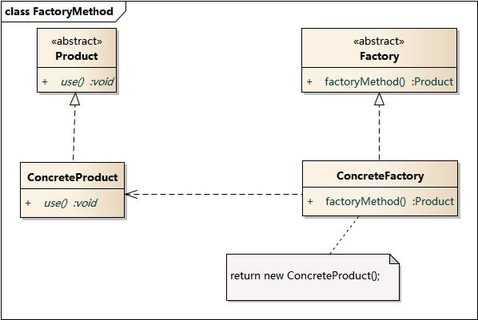
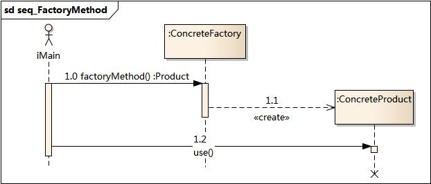

## 工厂设计模式

工厂方法模式(Factory Method Pattern)又称为工厂模式，也叫做虚拟构造器(Virtual Constructor)模式或者多态工厂(Polymorphic Factory)。它属于创建型模式。

**在工厂设计模式中，工厂父类负责定义创建产品对象的公共接口，而工厂子类负责生成具体的产品对象，这样做的目的是将产品实例化操作延迟到工厂子类中完成，即通过工厂子类来确定究竟实例化哪一个具体产品类。**

### 模式结构

工厂方法模式包含如下角色：

- Product：抽象产品
- ConcreteProduct：具体产品
- Factory：抽象工厂
- ConcreteFactory：具体工厂

### 时序图

### 例子

以下示例演示了如何使用工厂方法开发跨平台UI（用户界面）组件， 并同时避免客户代码与具体UI类之间的耦合。

[代码](../../main/java/creational/factorymethod)

### 适用场景

- 一个类不知道它所需要的对象的类：在工厂方法模式中，客户端不需要知道具体产品类的类名，只需要知道所对应的工厂即可，具体的产品对象由具体工厂类创建；客户端需要知道创建具体产品的工厂类。
- 一个类通过其子类来指定创建哪个对象：在工厂方法模式中，对于抽象工厂类只需要提供一个创建产品的接口，而由其子类来确定具体要创建的对象，利用面向对象的多态性和里氏代换原则，在程序运行时，子类对象将覆盖父类对象，从而使得系统更容易扩展。
- 将创建对象的任务委托给多个工厂子类中的某一个，客户端在使用时可以无须关心是哪一个工厂子类创建产品子类，需要时再动态指定，可将具体工厂类的类名存储在配置文件或数据库中。

### 实现方式

1. 让所有产品都遵循同一接口。 该接口必须声明对所有产品都有意义的方法。

2. 在创建类中添加一个空的工厂方法。 该方法的返回类型必须遵循通用的产品接口。

3. 在创建者代码中找到对于产品构造函数的所有引用。 将它们依次替换为对于工厂方法的调用， 同时将创建产品的代码移入工厂方法。 你可能需要在工厂方法中添加临时参数来控制返回的产品类型。

4. 工厂方法的代码看上去可能非常糟糕。 其中可能会有复杂的switch分支运算符，用于选择各种需要实例化的产品类。 但是不要担心，我们很快就会修复这个问题。

5. 现在， 为工厂方法中的每种产品编写一个创建者子类， 然后在子类中重写工厂方法， 并将基本方法中的相关创建代码移动到工厂方法中。

如果应用中的产品类型太多， 那么为每个产品创建子类并无太大必要， 这时你也可以在子类中复用基类中的控制参数。

例如， 设想你有以下一些层次结构的类。基类邮件及其子类航空邮件和陆路邮件；运输及其子类飞机,卡车和火车。航空邮件仅使用飞机对象， 而陆路邮件则会同时使用卡车和火车对象。 你可以编写一个新的子类 （例如
火车邮件）来处理这两种情况，但是还有其他可选的方案。 客户端代码可以给陆路邮件类传递一个参数，用于控制其希望获得的产品。

如果代码经过上述移动后， 基础工厂方法中已经没有任何代码， 你可以将其转变为抽象类。 如果基础工厂方法中还有其他语句， 你可以将其设置为该方法的默认行为。

### 优缺点

优点:

- [x] 你可以避免创建者和具体产品之间的紧密耦合。
- [x] 单一职责原则。 你可以将产品创建代码放在程序的单一位置， 从而使得代码更容易维护。
- [x] 开闭原则。 无需更改现有客户端代码， 你就可以在程序中引入新的产品类型。

缺点:

- [ ]  应用工厂方法模式需要引入许多新的子类， 代码可能会因此变得更复杂。 最好的情况是将该模式引入创建者类的现有层次结构中。

