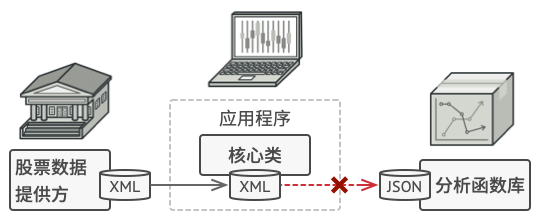

## 适配器模式

适配器模式是一种结构型设计模式， 它能使接口不兼容的对象能够相互合作。

### 问题

假如你正在开发一款股票市场监测程序， 它会从不同来源下载 XML 格式的股票数据， 然后向用户呈现出美观的图表。

在开发过程中， 你决定在程序中整合一个第三方智能分析函数库。 但是遇到了一个问题， 那就是分析函数库只兼容 JSON 格式的数据。

> 你无法 “直接” 使用分析函数库， 因为它所需的输入数据格式与你的程序不兼容。

你可以修改程序库来支持 XML。 但是，这可能需要修改部分依赖该程序库的现有代码。 甚至还有更糟糕的情况，你可能根本没有程序库的源代码， 从而无法对其进行修改。

### 解决方案

我们可以借助适配器模式来解决这个问题，适配器模式就是解决接口不兼容的对象之间的合作问题。

### 模式结构

角色:

- Target：目标抽象类
- Adapter：适配器类
- Adaptee：适配者类
- Client：客户类 适配器模式有对象适配器和类适配器两种实现：

> 类适配器中适配器同时继承两个对象的接口。 请注意， 这种方式仅能在支持多重继承的编程语言中实现

### 时序图

### 例子

电脑有美国和中国的笔记本电脑，但是如果你带着中国的笔记本电脑去美国的话，他们那边的插座是和你的笔记本的插座是不匹配的，因此你需要使用一个转接头(Adapter)来帮助你充电。

[代码](../../main/java/structural/adapter)
