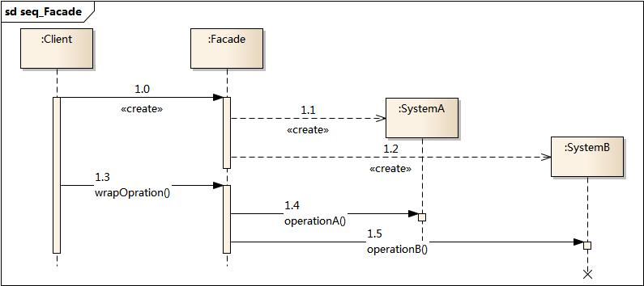

## 外观模式

外观模式也叫门面模式、Facade，它是一种结构型设计模式，能为程序库、框架或者其他复杂类提供一个简单的接口。

外观类为包含许多活动部件的复杂子系统提供一个简单的接口。与直接调用子系统相比，外观提供的功能可能比较有限，但是它却包含了客户端真正关心的问题。

### 模式结构

外观模式包含如下角色：

- Facade: 外观角色
- SubSystem:子系统角色

### 时序图

### 例子

在本例中， 外观模式简化了客户端与复杂视频转换框架之间的交互。

> 使用单个外观类隔离多重依赖的示例

[代码](../../main/java/structural/facade)

